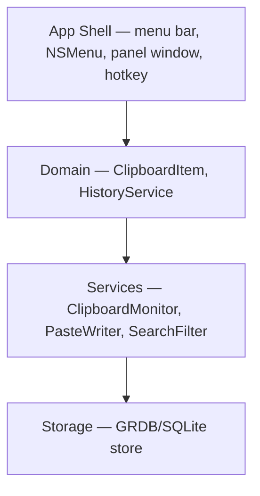
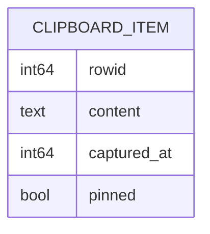

# Architecture Spine — OpenClipText

## Design Paradigm

**Layered**, four layers mapped to directories. Strict downward dependency: each layer may only depend on the layer below.



## Invariants & Rules

### AD-1 — Swift native stack

- **Binds:** all
- **Prevents:** divergence into Electron/JS hybrid or cross-platform framework
- **Rule:** App is Swift + SwiftUI/AppKit. Menu bar UI via NSStatusItem/NSMenu; history panel via SwiftUI window. No web views, no JS runtime.

### AD-2 — SQLite persistence via GRDB

- **Binds:** FR-4, FR-14, FR-8
- **Prevents:** flat-file storage divergence; unindexed search/dedup at scale
- **Rule:** All history persists in a single SQLite database (GRDB) at the app's Application Support directory. Table `clipboard_items` — the only store of history; no in-memory-only duplicates as source of truth.

### AD-3 — NSPasteboard polling as sole recording mechanism

- **Binds:** FR-1, NFR-3
- **Prevents:** invented push/event mechanisms that don't exist on macOS
- **Rule:** Recording = polling `NSPasteboard.general.changeCount` on a ~250ms timer. Text-only extraction (`string` types). Items larger than 1MB are not recorded. Excluded apps (by bundle ID, from frontmost application at capture time) are skipped.

### AD-4 — Two-surface UI: NSMenu quick list + history panel

- **Binds:** FR-5, FR-6, FR-7, FR-9, FR-10, FR-11
- **Prevents:** search/preview features forcing rewrite of the quick list, or quick-list limits crippling preview UX
- **Rule:** Quick list is an NSMenu (numbers 1–9, paginated 20 items, one-line truncation). Search, full history, and chunked hover preview live only in a separate SwiftUI panel window. The two surfaces never duplicate feature logic — both read from HistoryService.

### AD-5 — Chunked preview invariant

- **Binds:** FR-9, FR-10, FR-11, NFR-1
- **Prevents:** the lag bug the PRD exists to fix — full-text render on hover
- **Rule:** Preview rendering never receives full text. A `PreviewChunk` (max 10 lines / 500 chars, whichever first, + "+N more lines" indicator) is computed at storage-read time. Full text is rendered only on explicit expand action in the panel.

### AD-6 — Selection writes to the system clipboard

- **Binds:** FR-7, UJ-1
- **Prevents:** private paste mechanism (synthetic keystrokes / CGEvent paste) divergence
- **Rule:** Choosing an item sets the system clipboard via `NSPasteboard`; the user then pastes with `⌘V`. The app never simulates keystrokes.

### AD-7 — Dedup and pin order

- **Binds:** FR-2, FR-8
- **Prevents:** history order divergence between quick list and panel
- **Rule:** Single ordering rule owned by HistoryService: pinned items first (never moved), then unpinned by most-recent. Re-copying existing text updates its timestamp and moves it to top — unless pinned.

## Consistency Conventions

| Concern | Convention |
| --- | --- |
| Naming | Swift types UpperCamelCase; services end in `Service`/`Monitor`; DB table/columns snake_case |
| Data & formats | Item id = SQLite rowid; timestamps as Unix epoch seconds (Integer); excluded apps = bundle ID strings in UserDefaults key `excludedBundleIDs` |
| State & cross-cutting | All DB writes go through `HistoryStore`; UI never touches GRDB directly. Errors surfaced as Swift `throws`; no global error state |

## Stack

| Name | Version |
| --- | --- |
| Swift | 5.10+ |
| SwiftUI / AppKit (NSStatusItem, NSMenu) | macOS 13+ SDK |
| GRDB.swift | 7.x |
| Platform | macOS 13 Ventura+ |

## Structural Seed

```text
OpenClipText/
  OpenClipTextApp/        # app shell: status item, menu, panel window, hotkey registration
  Domain/                 # ClipboardItem model, HistoryService (ordering/dedup/pin rules)
  Services/               # ClipboardMonitor (polling), PasteWriter, SearchFilter
  Storage/                # HistoryStore (GRDB), migrations
  Resources/              # assets, excluded-apps defaults
```



## Capability → Architecture Map

| Capability / Area | Lives in | Governed by |
| --- | --- | --- |
| FR-1/FR-3 recording | ClipboardMonitor | AD-3 |
| FR-2/FR-8 order & dedup | HistoryService | AD-7 |
| FR-4 persistence | HistoryStore | AD-2 |
| FR-5/FR-6/FR-7 quick list | App Shell (NSMenu) | AD-4, AD-6 |
| FR-9/FR-10/FR-11 preview | History panel | AD-4, AD-5 |
| FR-12/FR-13 delete/clear | HistoryService + HistoryStore | AD-2 |
| FR-14 search | SearchFilter + panel | AD-4 |
| FR-15 exclude apps | ClipboardMonitor | AD-3 |
| NFR-2 autostart | App Shell (login item) | — |
| NFR-4 shortcuts | App Shell (Carbon hotkey / Carbon-free alternative) | AD-6 |

## Deferred

- Exact chunk constants (lines/chars) — UI-level tuning, panel owns it.
- Hotkey API choice (Carbon RegisterEventHotKey vs. newer) — implementation detail, either satisfies FR-6.
- Login-item mechanism (SMAppService vs. legacy) — implementation detail.
- Rich-text recording — explicitly out of v1 (PRD).
- App icon, menu pagination exact page size — UI detail.
- Deployment: unsigned local build assumed; revisit only if distributing.
